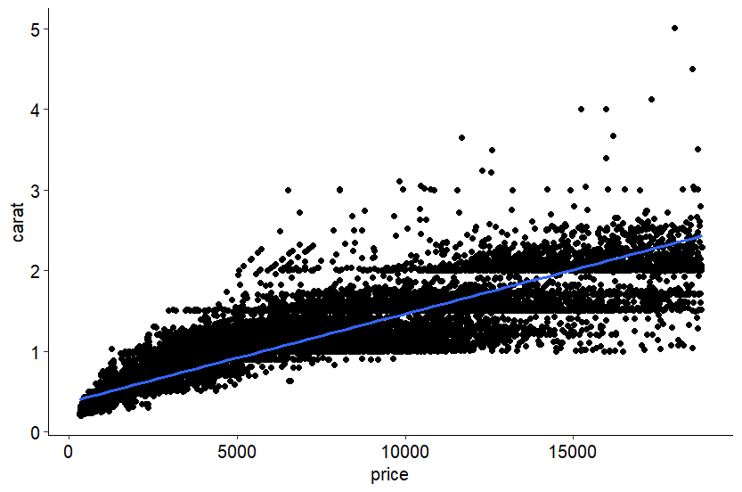

<h1 align="center">Linear-Regression-with-R</h1>
Simple linear Regression with R.

## A. Introduction

### 1. Dataset Description

| Field        | Description |
|--------------|-------------|
| **Title**    | Diamonds Characteristics and Pricing Analysis |
| **Author**   | Zahra Nusrat |
| **Description** | The diamonds dataset provides comprehensive information about thousands of gemstones that have been sold. Each record includes attributes such as carat weight, cut quality, color rating, clarity level, price, and physical dimensions. These features support analysis on how quality factors influence diamond value and are suitable for EDA, visualization, and machine learning tasks such as price prediction. |
| **Access Date** | 25/11/2025 |
| **Source**   | https://www.kaggle.com/datasets/zahranusrat/diamonds-characteristics-and-pricing-analysis |

### 2. Workflow and Objective

The task is performed by selecting two variables from the *Diamonds Characteristics and Pricing Analysis* dataset: **Carat** as the independent variable (intercept) and **Price** as the dependent variable. The objective is to determine whether carat weight has a significant influence on the price of a diamond.

## B. Code

```r
library(gdata)
diamonds = read.csv('diamonds.csv')
head(diamonds)

install.packages("tidyverse")
install.packages("ggpubr")

library(tidyverse)
library(ggpubr)
theme_set(theme_pubr())

carat = diamonds$carat
price = diamonds$price

model = lm(carat ~ price)
model

ggplot(diamonds, aes(x = price, y = carat))+
  geom_point()+
  stat_smooth(method = lm)

cor(price, carat)

summary(model)

```

### 2. Code Explanation and Console Output

#### a. Importing and Visualizing the Dataset

```r
library(gdata)
diamonds = read.csv('diamonds.csv')
head(diamonds)
```
The dataset is imported using the gdata library, and the first six rows are displayed using the head() function.

Console Output:
```console
> head(diamonds)
  carat       cut color clarity depth table    x    y    z price
1  0.23     Ideal     E     SI2  61.5    55 3.95 3.98 2.43   326
2  0.21   Premium     E     SI1  59.8    61 3.89 3.84 2.31   326
3  0.23      Good     E     VS1  56.9    65 4.05 4.07 2.31   327
4  0.29   Premium     I     VS2  62.4    58 4.20 4.23 2.63   334
5  0.31      Good     J     SI2  63.3    58 4.34 4.35 2.75   335
6  0.24 Very Good     J    VVS2  62.8    57 3.94 3.96 2.48   336
```

#### b. Installing and Importing Required Libraries

```r
install.packages("tidyverse")
install.packages("ggpubr")

library(tidyverse)
library(ggpubr)

theme_set(theme_pubr())
```
The tidyverse and ggpubr libraries are installed using install.packages(), and then loaded with the library() function.
If loading tidyverse results in conflicts between functions from different packages, the console may display messages such as:

```console
── Attaching core tidyverse packages ───────────────────────────────────────── tidyverse 2.0.0 ──
...
── Conflicts ─────────────────────────────────────────────────────────── tidyverse_conflicts() ──
✖ dplyr::combine()     masks gdata::combine()
✖ dplyr::filter()      masks stats::filter()
✖ dplyr::first()       masks gdata::first()
✖ purrr::keep()        masks gdata::keep()
✖ dplyr::lag()         masks stats::lag()
✖ dplyr::last()        masks gdata::last()
✖ dplyr::starts_with() masks tidyr::starts_with(), gdata::starts_with()
ℹ Use the conflicted package to force all conflicts to become errors

```
To resolve these conflicts, the devtools library can be installed to enable installation of third-party packages, including conflicted, which helps manage function name conflicts.

Console Output:
```console
> install.packages("devtools")
> devtools::install_github("r-lib/conflicted")
WARNING: Rtools is required to build R packages, but is not currently installed.
Please download and install Rtools 4.5 from https://cran.r-project.org/bin/windows/Rtools/.

Downloading GitHub repo r-lib/conflicted@HEAD
...
* DONE (conflicted)
```

#### c. Assigning Dataset Columns to Variables

```r
carat = diamonds$carat
price = diamonds$price
The variables carat and price are created by extracting their respective columns from the dataset.
```

#### d. Building the Regression Model

```r
model = lm(carat ~ price)
model
```
A regression model is built using lm(carat ~ price) to determine the relationship between carat weight and price.
The model outputs the intercept and the coefficient for the price variable.

Console Output:
```console
> model = lm(carat ~ price)
> model

Call:
lm(formula = carat ~ price)

Coefficients:
(Intercept)        price  
  0.3672972    0.0001095
```

#### e. Visualizing the Regression Model with ggplot()
```r
ggplot(diamonds, aes(x = price, y = carat)) +
  geom_point() +
  stat_smooth(method = lm)
```
The regression model is visualized using ggplot() by plotting the data points and adding a linear regression line.

#### f. Correlation Between Variables
```r
cor(price, carat)
```
The correlation between carat and price is calculated using the cor() function.

Console Output:
```console
> cor(price, carat)
[1] 0.9215913
```

#### g. Model Summary Output

```r
summary(model)
```
The summary() function provides a detailed statistical overview of the regression model, including residual distribution, coefficient estimates, significance levels, R-squared values, and overall model performance.

Console Output:
```console
Call:
lm(formula = carat ~ price)

Residuals:
     Min       1Q   Median       3Q      Max 
-1.35765 -0.11329 -0.02442  0.10344  2.66973 

Coefficients:
             Estimate Std. Error t value Pr(>|t|)    
(Intercept) 3.673e-01  1.112e-03   330.2   <2e-16 ***
price       1.095e-04  1.986e-07   551.4   <2e-16 ***
---
Signif. codes:  
0 ‘***’ 0.001 ‘**’ 0.01 ‘*’ 0.05 ‘.’ 0.1 ‘ ’ 1

Residual standard error: 0.184 on 53938 degrees of freedom  
Multiple R-squared: 0.8493  
Adjusted R-squared: 0.8493  
F-statistic: 3.041e+05 on 1 and 53938 DF, p-value: < 2.2e-16
```

## C. Linear Regression: Carat ~ Price

### 1. Plot


### 2. Coefficient Correlation

|               | Estimate     | Std. Error     | T Value |
|--------------|-------------|--------------|-------------|
|(Intercept)    | 3.673e-01    | 1.112e-03      | 330.2 |
|Price          | 1.095e-04    | 1.986e-07      | 551.4 |
|Coefficient     |0.9215913|


### 3. Summary

#### a. Residuals
|   Min     |    Q1     |  Median   |    Q3     |   Max    |
|-----------|-----------|-----------|-----------|----------|
| -1.35765  | -0.11329  | -0.02442  |  0.10344  | 2.66973  |

#### b. RSE
|RSE|
|--------------|
|0.184|

#### c. R-Squared
|Multiple   |Adjusted|
|--------------|-------------|
|0.8493     |0.8493|

#### d. R-Squared
|F-Statistic|
|--------------|
|3.041e+05|

#### d. P-Value

|P-Value|
|--------------|
|< 2.2e-16|


### 4. Conclusion
The linear regression analysis indicates a strong positive relationship between price and carat. As the price of a diamond increases, its carat value also tends to be higher.
This relationship is supported by a high correlation coefficient of approximately 92%, showing a clear and consistent upward trend between the two variables.

unfotunately, no Risa in this repo :(
